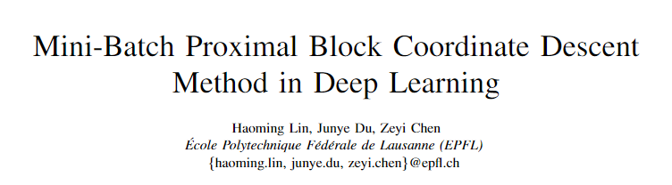
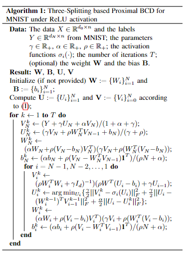
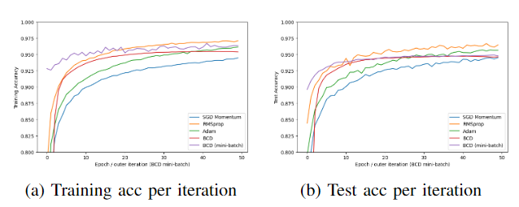
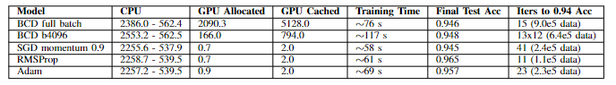
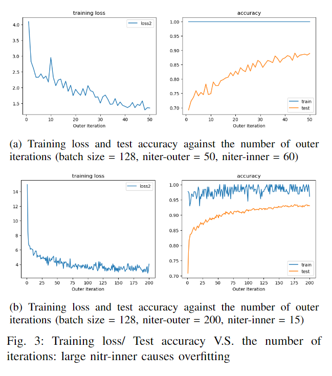

# EPFL_CS439_Optimization_Project
## This is the repo of the CS439-Optimization for machine learning, EPFL. ##

*Deep learning continues to be the subject of widespread attention due to its remarkable empirical accomplishments, however, training DNNs is notably intricate due to the complexity associated with nonconvex optimization. Traditionally, the backpropagation algorithm has been utilized extensively as the cornerstone for first order gradient descent-oriented algorithms. Recent research has underscored the efficiency of some zero-order optimization methods in deep learning like block coordinate descent algorithm, which shows tremendous potential for training DNNs. In this project, we reimplement and simplify the BCD aglorithm on MNIST dataset and solve out the proximal iterations step under the condtion of ReLU activation, at the same time
compare its performance with mainstream gradient algorithms.*  
  
In this repo, we reimplement the proximal BCD algorithm, fathom out the explicit expression of the iteration under ReLU activation function and generalize it into mini-batch version consisting of inner and outer loop. Through iterative testing and balancing adjustments of hyperparameters such as batchsize and the number of inner/outer iterations, we sought to examine their influence on the training outcomes. Moreover, a detailed comparison between proximal BCD and SGD-like algorithms was carried out to provide a comprehensive understanding of their relative efficacy.  

The algorithm comparison:  

The influence of other factors:  

For detailed information, you could see the attached report or email me at *junyedu2-c@my.cityu.edu.hk*.